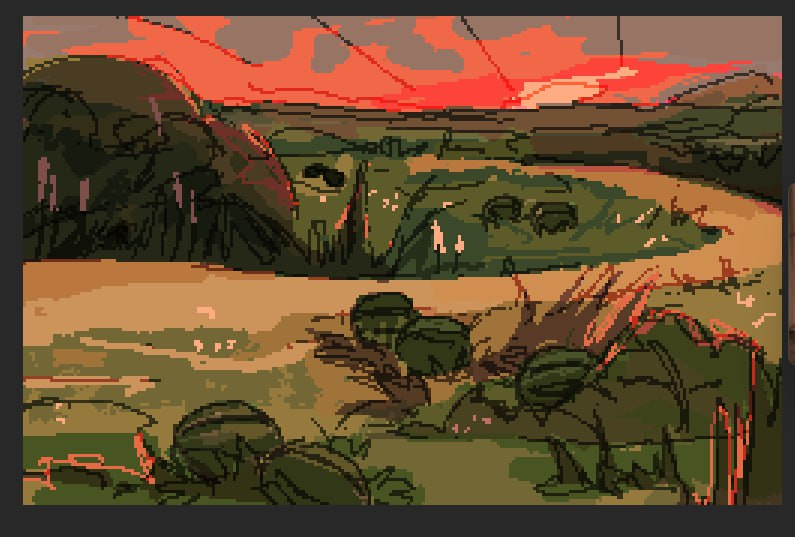

Тут ми робимо гру.
# ДЕ ДИЗАЙН-ДОКУМЕНТ

# -> [Основна інформація](/world/_index.md) <-

- [Етнолог](https://ss.etnolog.org.ua/nomeri/)
- [декілька книжок](https://spadok.org.ua/biblioteka/top-10-knyg-z-ukrayinskoyi-mifologiyi)
- [вікіпедія демонологія](https://uk.wikipedia.org/wiki/%D0%A3%D0%BA%D1%80%D0%B0%D1%97%D0%BD%D1%81%D1%8C%D0%BA%D0%B0_%D0%B4%D0%B5%D0%BC%D0%BE%D0%BD%D0%BE%D0%BB%D0%BE%D0%B3%D1%96%D1%8F)

<!--  -->

# Більше

The missionary Nestor the Chronicler describes a state pantheon introduced by Prince Vladimir I in Kyiv in 980 CE. This pantheon worshiped the gods Perun, Hors, Dažbog, Stribog, Simargl, and Mokosh.
Semargl

Grammaticus also mentioned the multi-headed deities such as Porentius, Rugievit and Porewit.

Вінітарій запросив Божа та розіп'яв на деревах

---

Первая часть — General, Gameplay, Game Modes, Game Peculiarities, Game World — функциональные блоки. Их будут смотреть все. Возможно, тот же самый сеттинг будет смотреть только продюсер, если ему будет интересно. Fraction Characters — тоже идет в сеттинг. Сюжет — Plot Synopsis — на одну страницу. Similar Games and Landmarks может смотреть маркетинг.

Development Parameters — тоже будут смотреть все. Production (Key People, General Remarks), Comment and Changes тоже может смотреть какой-то отдельный отдел. Ввиду того, что конкретно этот жанр — с жестким упором на историю, я использую несколько нетрадиционный подход и выношу в конец документа информацию по поводу сравнительных игр-механик, а также Development Parameters и продакшен, обрамляя кусок по сеттингу. Возможно, вы захотите делать по-другому и сначала предоставить информацию о Development Parameters и т.д., а  только потом писать по поводу самой игры.

---

Ідея протистояння сил добра і зла, світлого й темного пронизує міфологізм слов´янського вірування та світосприймання. Особливо яскравими постають сили світлоносні й сонцеликі. Весь Всесвіт оживотворений огнесвітом, духом краси, гармонії й розуму, сином красної любові — Лади, великим Ладом, Білим добрим богом, святим витязем, другом людини, котрий протистоїть у боротьбі Чорно-богові. Все на землі оживлене духами, які допомагають або доброму, або злому началу.

Ще один важливий мотив загальнослов'янської міфології: пошуки спільних гуманістичних основ язичницької та християнської віри. В синкретизмі, що мав місце в минулому, все ж залишалася відчутною різнорідність і волюнтарність поєднання релігійних основ. У той же час у легендарних переказах про подвижників віри, захисників добра й уособлення ідеалу правди вбачалася правічна єдність усіх начал. "Ця ідея втілення, — саме в цьому руслі спрямовує свою думку М. Костомаров, — страждання й торжества божественної істини на землі була найдивовиж-нішим передчуттям пришестя сина Божого, сонця правди, світла істини...".
